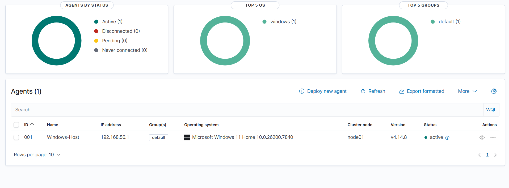

# Screenshot Evidence

This folder stores screenshots used as evidence for the SOC Home Lab.

## Rules

- Do not upload passwords, tokens, API keys, private email addresses, or other sensitive information.
- Crop screenshots so the relevant evidence is easy to identify.
- Use clear filenames in chronological order.
- Refer to screenshots from the relevant investigation or detection document.

## Suggested Naming

```text
01-lab-network.png
02-wazuh-dashboard.png
03-agent-connected.png
04-sysmon-event.png
05-failed-login-alert.png
06-investigation-search.png
```

## Current Evidence

- `5C5B67F3-EA97-4684-9DAD-E3C30866D0D5.png` — Wazuh dashboard showing the `Windows-Host` endpoint at `192.168.56.1` with agent version `4.14.8` and **Active** status. This proves the Windows endpoint successfully enrolled with and is communicating with the Wazuh manager.

### Wazuh agent active



The Wazuh dashboard shows the `Windows-Host` endpoint at `192.168.56.1` running agent version `4.14.8` with **Active** status.
