# Screenshot Evidence

This folder stores screenshots used as evidence for the SOC Home Lab.

## Rules

- Do not upload passwords, tokens, API keys, private email addresses, or other sensitive information.
- Crop screenshots so the relevant evidence is easy to identify.
- Use clear filenames in chronological order.
- Refer to screenshots from the relevant investigation or detection document.

## Suggested Naming

```text
01-host-only-network.png
02-wazuh-ip-addresses.png
03-connectivity-test.png
04-wazuh-agent-active.png
05-sysmon-event.png
06-wazuh-sysmon-ingestion.png
07-failed-login-event-details.png
08-failed-login-wazuh-rule.png
09-powershell-command-details.png
10-powershell-rule-92027.png
11-powershell-no-child-processes.png
12-test-netconnection-success.png
13-custom-test-netconnection-alert.png
14-custom-rule-process-details.png
15-custom-rule-evidence.png
16-event3-pid-correlation.png
17-network-scope-count.png
18-no-child-processes-found.png
```

## Current Evidence

### 04 - Wazuh agent active


The Wazuh dashboard shows the `Windows-Host` endpoint at `192.168.56.1` running Wazuh agent version `4.14.8` with **Active** status. This confirms that the Windows endpoint has successfully enrolled with and is communicating with the Wazuh manager over the isolated lab network.

### 05 - Sysmon Event ID 1

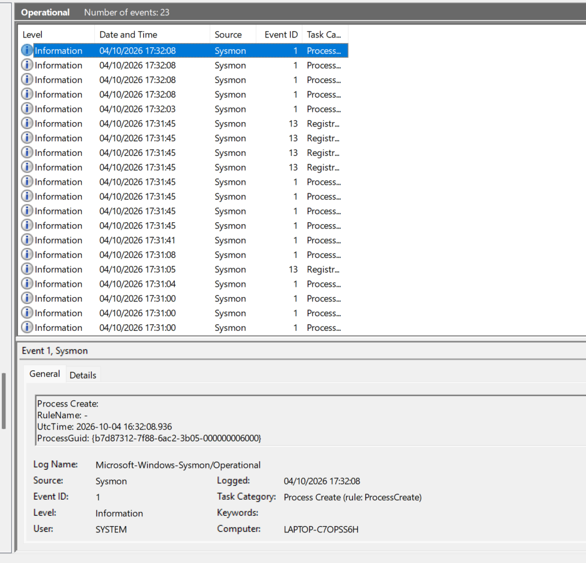

Windows Event Viewer shows the `Microsoft-Windows-Sysmon/Operational` log generating **Event ID 1 (Process Create)** events. This confirms that Sysmon is installed correctly and producing endpoint telemetry locally.

### 06 - Wazuh Sysmon ingestion

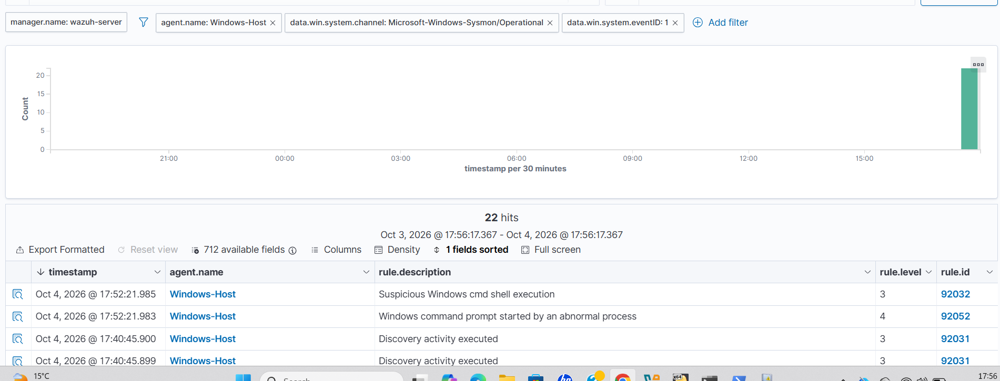

Wazuh Threat Hunting was filtered to `Windows-Host`, the `Microsoft-Windows-Sysmon/Operational` channel, and **Event ID 1**. The returned events confirm that Sysmon process-creation telemetry from the Windows host is being ingested and is searchable in Wazuh.

### 07 - Failed login event details

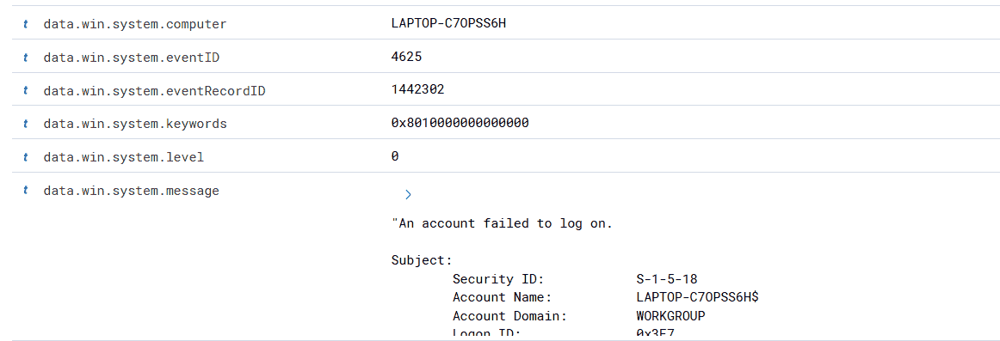

Wazuh event details show Windows Security **Event ID 4625**, confirming that the monitored Windows endpoint recorded an account logon failure.

### 08 - Wazuh failed-login rule

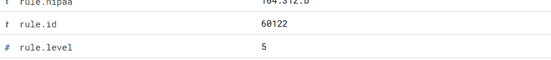

Wazuh matched the failed-authentication event to **rule 60122** at **level 5**. This provides SIEM-side evidence that the Windows authentication failure was collected and detected.

### 09 - PowerShell command and process details

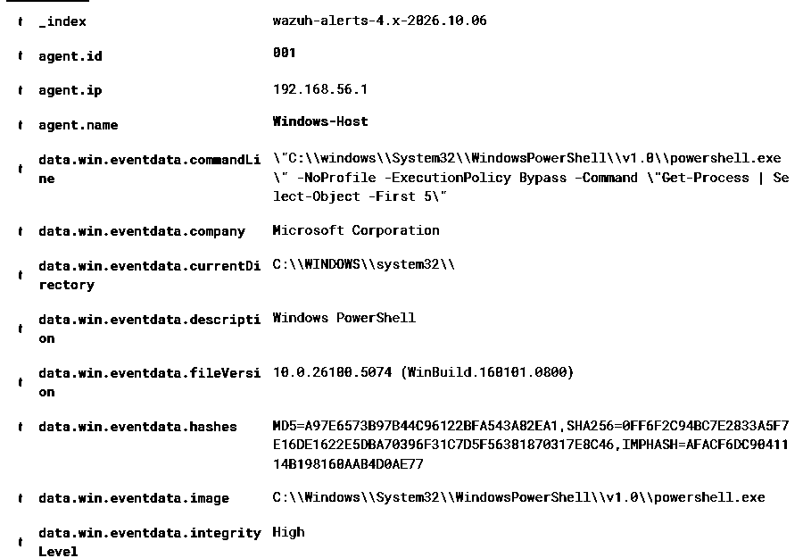

Sysmon Event ID 1 records the controlled PowerShell process and its full command line, including `-NoProfile`, `-ExecutionPolicy Bypass`, and `Get-Process | Select-Object -First 5`. The event also records the PowerShell image, user context, process ID, parent process information, and high integrity level used during the lab test.

### 10 - Wazuh PowerShell rule 92027


Wazuh matched the process-creation telemetry to **rule 92027** at **level 4**, with the description `Powershell process spawned powershell instance`. The alert is mapped to **MITRE ATT&CK T1059.001 - PowerShell** under the Execution tactic, which is supported by the observed telemetry.

### 11 - PowerShell scope check


Wazuh was filtered to the monitored Windows host, the Sysmon Operational channel, **Event ID 1**, and `parentProcessId = 6880` over the last 24 hours. The query returned **No results match your search criteria**, providing evidence that no additional child-process creation for PID 6880 was found in the Wazuh data reviewed.

### 12 - Test-NetConnection success

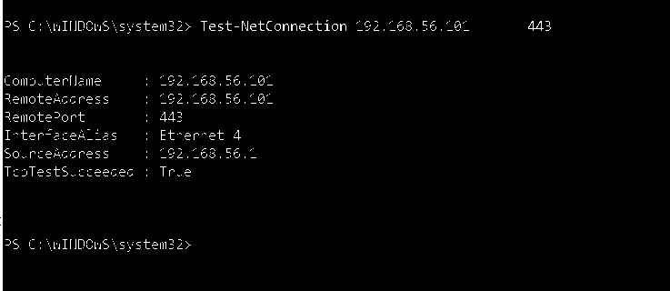

Windows PowerShell successfully tested TCP connectivity from source IP `192.168.56.1` to the lab Wazuh manager at `192.168.56.101` on port `443`. The output showed `TcpTestSucceeded: True`, documenting the controlled network activity used in Scenario 3.

### 13 - Custom Wazuh Test-NetConnection alert

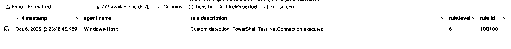

Wazuh Threat Hunting shows one alert from `Windows-Host` for custom **rule 100100** at **level 6**, with the description `Custom detection: PowerShell Test-NetConnection executed`. This confirms that the custom detection fired successfully.

### 14 - Custom rule process details

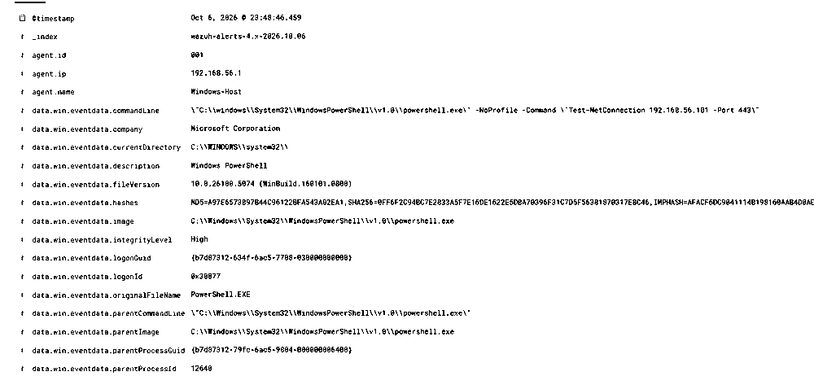

The alert details show Sysmon process telemetry for `powershell.exe`, including the full `Test-NetConnection 192.168.56.101 -Port 443` command line, the PowerShell image, high integrity level, and PowerShell parent process. These fields provide the context needed to validate and identify the detected process.

### 15 - Custom rule evidence

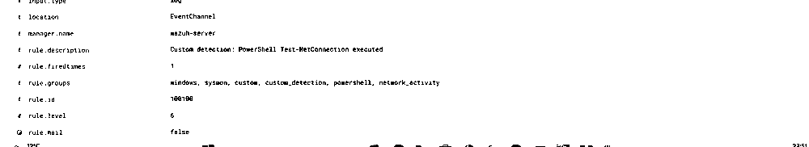

The expanded Wazuh event confirms **Sysmon Event ID 1**, the monitored Windows host and user context, and custom **rule 100100** at **level 6**. The rule groups include `custom_detection`, `powershell`, and `network_activity`.

### 16 - Sysmon Event ID 3 PID correlation

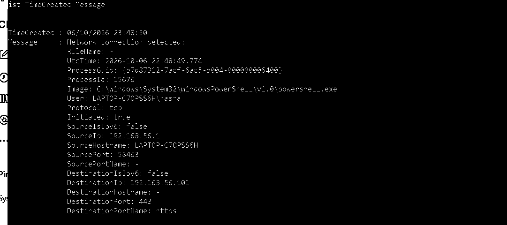

Local Sysmon **Event ID 3 (Network Connection)** telemetry shows PowerShell PID `15676` initiating a TCP connection from `192.168.56.1:58463` to `192.168.56.101:443`. This correlates the Wazuh process alert with the actual network connection generated by the same process ID.

### 17 - Network scope count

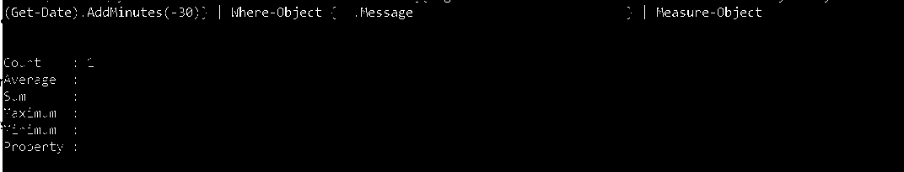

A 30-minute Sysmon Event ID 3 query for PID `15676` returned **Count = 1**. The supported conclusion is that one matching network connection was found for that PID in the reviewed time window.

### 18 - Child-process scope check

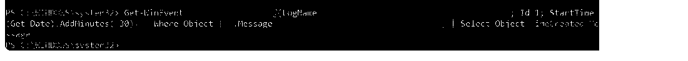

A 30-minute Sysmon Event ID 1 query for `ParentProcessId: 15676` returned no matching output. This supports the limited conclusion that no child process creation from PID `15676` was found in the Sysmon data reviewed.
