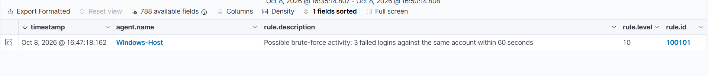
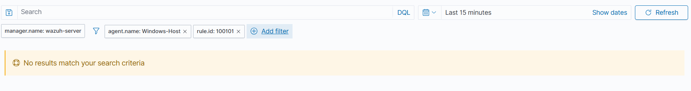
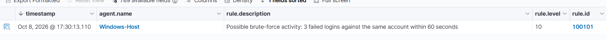
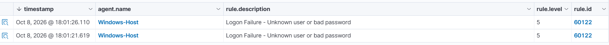
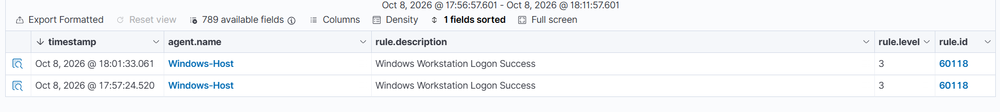

# Project 2 — Wazuh Evidence Index

**Status:** **26 original PNG screenshots verified on GitHub:** 19 for Investigation 01 and 7 relevant screenshots for Investigation 02. Two low-value cropped side-event files (22 and 23) were removed during review. The key McAfee process-detail screenshot `25-mcafee-webadvisor-process-details.png` has **not** been uploaded. Every retained image belongs to Project 2; Project 1 is untouched.

All images live together in the dedicated Project 2 evidence directory and are grouped below by investigation and purpose. The original 19 files support Investigation 01. Seven newly uploaded files support Investigation 02, although the McAfee process-detail image is still missing. The investigation reports link directly to the corresponding images.

## 1. Lab setup and rule configuration (4 images)

| Evidence | What it demonstrates |
| --- | --- |
| [01 — Wazuh agent running](./01-wazuh-agent-running.png) | Windows agent visible in Wazuh |
| [02 — Test account created](./02-test-account-created.png) | Dedicated local `SOC-Lab-Test` account |
| [04 — Custom Wazuh rule](./04-custom-rule-100101.png) | XML logic for rule `100101`, added without replacing the Project 1 rule |
| [05 — Wazuh Manager running](./05-manager-active.png) | Service active after the rules were loaded |

## 2. Initial failed-logon analysis and positive test (6 images)

| Evidence | What it demonstrates |
| --- | --- |
| [03 — Three individual failures](./03-three-individual-failures.png) | Three level-5 `60122` alerts |
| [03a — Target username and 4625](./03a-target-username-event4625.png) | Windows Security Event ID `4625` and targeted test account |
| [03b — Source and logon type](./03b-source-and-logontype.png) | Loopback source `127.0.0.1` and local interactive Logon Type 2 |
| [06 — Correlated Level 10 alert](./06-positive-100101-alert.png) | `100101` triggered at 16:47:18 |
| [07 — Correlation details](./07-positive-alert-details.png) | Frequency and `previous_output` evidence |
| [07a — MITRE mapping](./07a-positive-mitre-mapping.png) | T1110 mapping on the custom rule; **not evidence of a real attacker** |

**Representative positive-test alert:**

## 3. Isolated single-failure negative test (2 images)

| Evidence | What it demonstrates |
| --- | --- |
| [08 — Single 60122 failure](./08-negative-60122-alert.png) | One ordinary failed login at 16:55:28, without a new correlation alert in the reviewed window |
| [09 — Single failure target account](./09-negative-test-account.png) | Target account `SOC-Lab-Test` |

## 4. Mixed-account negative test, two-plus-one (5 images)

| Evidence | What it demonstrates |
| --- | --- |
| [10 — Three 60122 failures](./10-mixed-account-three-failures.png) | Events at 17:18:01, 17:18:03 and 17:18:07 |
| [11 — Account 1, first failure](./11-mixed-account-user-one-first.png) | First event targeted `SOC-Lab-Test` |
| [11a — Account 1, second failure](./11a-mixed-account-user-one-second.png) | Second event targeted `SOC-Lab-Test` |
| [12 — Account 2, one failure](./12-mixed-account-user-two.png) | Third event targeted `SOC-Lab-Test2` |
| [13 — No new correlation alert](./13-mixed-account-no-correlation.png) | `100101` query returned no results in the test window |

**Representative negative-test search:**

## 5. Independent positive test on second account (2 images)

| Evidence | What it demonstrates |
| --- | --- |
| [14 — Second account rule 100101](./14-second-account-positive-alert.png) | New level-10 correlated alert at 17:30:13 |
| [15 — Second account identified](./15-second-account-alert-user.png) | Expanded `4625` event targeted `SOC-Lab-Test2` |

**Representative second-account positive test:**

## 6. Investigation 02 — Failed logins followed by a successful login (7 images)

These images support the [separate second investigation](../investigations/02-failed-then-successful-login.md). Files 22 and 23 were deliberately removed after review because they were cropped fragments of a separate failure that added little evidence and risked confusion. No file numbered 25 is present on GitHub yet.

| Evidence | What it actually shows | Use |
| --- | --- | --- |
| [16 — Wider failure alert list](./16-failed-logins-overview.png) | Multiple Wazuh 60122 failures around 18:01, including unrelated adjacent failures | Starting context only; usernames not shown |
| [17 — Successful login alert list](./17-test-account-success-list.png) | Wazuh rule 60118 at 18:01:33 and another earlier success | Identify relevant 4624 success |
| [18 — Source and Logon Type](./18-success-logon-type-and-ip.png) | The expanded success event has source IP 127.0.0.1 and Logon Type 2 | Local interactive context |
| [19 — Successful login username](./19-success-target-username.png) | `targetUserName: SOC-Lab-Test2` | Identify account (must be read with image 18) |
| [20 — Two failed login alerts](./20-two-failures-targeted-account.png) | Wazuh 60122 failures at 18:01:21 and 18:01:26 | Correlate timeline; the crop does *not* show the username filter |
| [21 — Separate failure process details](./21-separate-webview-failure-process.png) | A later 4625 event's WebView2 process and bad-password substatus | Separate event, target account not established |
| [24 — Nearby process alert list](./24-nearby-sysmon-process-alerts.png) | Wazuh 92052 and 92032 around 18:01:47 and other unrelated alerts | Scope potentially related activity; user/session not established |

**Representative login timeline evidence**

**Still missing:** `25-mcafee-webadvisor-process-details.png`, which would document the McAfee WebAdvisor BrowserHost.exe process discussed in the report. Until it is uploaded, that observation is sourced to the screenshots reviewed in conversation and the written investigation, *not* to a GitHub-hosted process-detail image.

**Evidence limitation:** The cropped rows in image 20 do not display the `targetUserName` filter. The account correlation was verified interactively during the lab and is recorded in the [transcribed timeline](../evidence/02-authentication-timeline.md), but these PNGs alone are not a full export of the original event records.

## How to interpret the evidence

Four controlled detection-validation scenarios were completed in Investigation 01. Investigation 02 then correlated two observed Windows 4625 failures with a 4624 successful sign-in to the same test account, while documenting limitations on surrounding alerts. Both investigations used authorised local activity, not production-ready detections or evidence of an attacker.

- [Detection design and validation](../detections/01-brute-force-correlation.md)
- [Investigation 01 — detection validation](../investigations/01-controlled-login-attempts.md)
- [Investigation 02 — failed-to-successful login](../investigations/02-failed-then-successful-login.md), with [textual evidence timeline](../evidence/02-authentication-timeline.md) and seven uploaded visual exhibits.
- [Project 2 overview](../README.md)
- [Interview summary](../INTERVIEW-SUMMARY.md)
- [Project 2 memory notes](../notes/WHAT-TO-MEMORISE.md)
- [Combined Project 1 + 2 20-card review](../../study/SOC-FLASHCARDS-PROJECTS-1-2.md)

**Privacy note:** The repository is public. Screenshots show lab host/account identifiers; review public images periodically for sensitive information. No passwords should be included.
